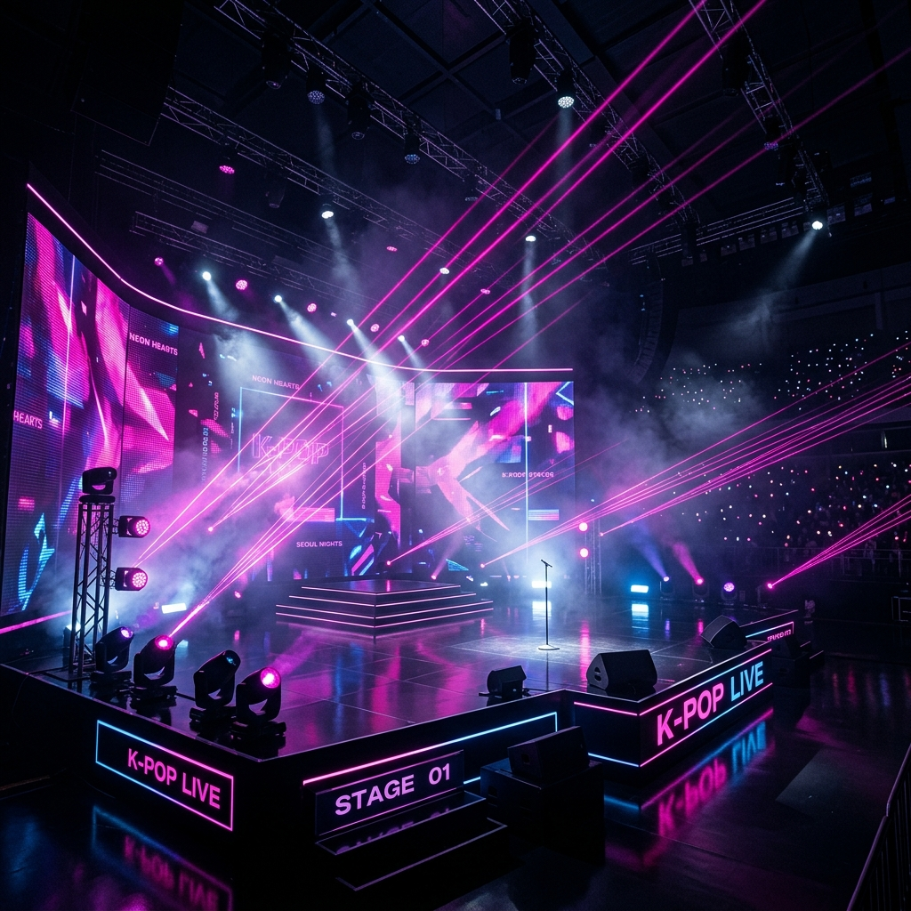

# 💖 My Blackpink Fan Website 💖



Welcome to the ultimate fan website for **BLACKPINK**! This project is a beautifully stylized, modern, and highly interactive web application dedicated to showcasing the members, their latest music, and testing your knowledge as a Blink.

🌐 **Live Demo:** [https://my-blackpink-website2.vercel.app](https://my-blackpink-website2.vercel.app)

---

## ✨ Features

- 🎧 **Persistent Spotify Player:** The website features a custom-built Vanilla JS Single Page Application (SPA) router. This means you can listen to the official "This Is BLACKPINK" Spotify playlist uninterrupted while navigating across different pages!
- 🎮 **The Ultimate Blink Trivia:** Test your knowledge! A fully functional trivia mini-game that tracks your score and awards you a specialized "Fan Rank" at the end.
- 🎇 **Interactive UI:** A highly aesthetic dark-neon theme ("fire" design) utilizing glassmorphism, dynamic gradients, and a custom **Neon Lightstick Click Effect** that sparks wherever you click.
- 📅 **Up-To-Date (2025/2026):** Features all the latest information regarding the group's "Deadline" World Tour, and the members' respective solo agencies (OA, LLOUD, BLISSOO, THEBLACKLABEL).

---

## 💻 Technologies Used

- **HTML5:** Semantic HTML for robust page structures.
- **CSS3:** Custom variables, CSS Grid/Flexbox, Glassmorphism, and advanced CSS filters/animations.
- **Vanilla JavaScript:** 
  - Custom SPA Router (pushState/fetch) for seamless page transitions.
  - Interactive game logic and UI effects.
- **Hosting:** Deployed instantly via [Vercel](https://vercel.com).

---

## 🚀 Running Locally

To run this project locally, you don't need any complex build tools. Simply clone the repository and open `index.html` in your favorite web browser!

```bash
git clone https://github.com/HemantTheCoder/MyBlackpinkWebsite2.git
cd MyBlackpinkWebsite2
# Open index.html in your browser
```

---

Created with 💖 by [HemantTheCoder](https://github.com/HemantTheCoder)
